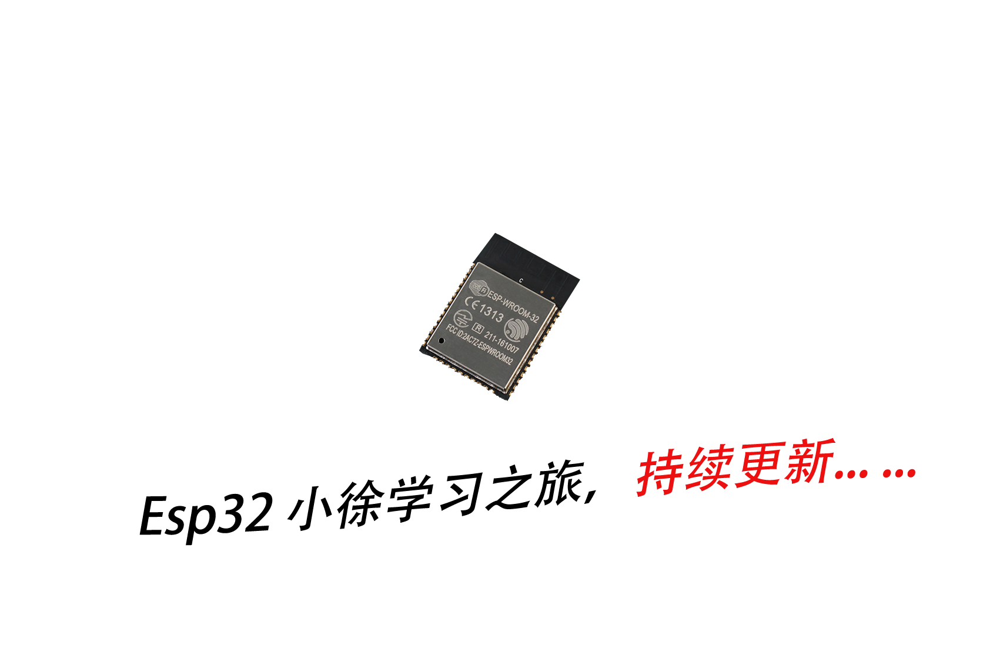

  

***************************************************
## 《StudyIn32》 小徐寄言：

> 与我的学习esp8266之旅一样，《StudyIn32》 的设计目的是用于帮助新手学习8266原生SDK的各种项目汇总，同时也有集成的项目，让开发者能在这基础代码的设计。不管是新项目的创建，或是已有项目的维护，均可使开发效率和项目质量得到大幅度提升。
> 小徐原创esp32的博文一览表：https://blog.csdn.net/xh870189248/article/category/7667042

***************************************************
### ①、使用方法：

- 第一步：请先搭建好`ESP32`的开发环境，您可以在`Linux`或者`Windows`系统上搭建：
 
 - `Linux`上搭建教程：https://blog.csdn.net/xh870189248/article/details/80208099
 - `Windows`上搭建教程：https://blog.csdn.net/xh870189248/article/details/80304624

- 第二步：上面的子文件均为单独的一个工程，如果你使用`eclipes`导进去，配好编译路径，直接编译即可！注意每个工程下面有个`alreadyBin`，顾名思义就是已经编译好的下载文件，您直接下载即可使用哦！

***************************************************
### ②、各项工程说明：
|工程名字|说明|对应博文链接|
|--------|------|-------|
|1_hello_world|串口打印`hello wrold`|-------|
|2_blink_led|利用`rtos`的延时函数时隔1s闪烁LED灯|-------|
|3_gpio_interrupt|`GPIO`的下降沿和上升沿中断的使用，以及高低电平的输出|https://blog.csdn.net/xh870189248/article/details/80354565|
|4_timer|体会esp32的强大的定时器功能， 实现定时2s闪烁一盏LED灯。|https://blog.csdn.net/xh870189248/article/details/80395289|
|6_smartConfig_AirKiss|smartConfig和微信airKiss在esp32的实现，一键配网轻松快捷连接路由器|https://blog.csdn.net/xh870189248/article/details/80430077|
|7_Key_Short_Long|利用GPIO中断做一个按键的短按和长按的回调事件，再也无须担心触发源。|https://blog.csdn.net/xh870189248/article/details/80524714|
|8_udp_client_server|实现本地 UDP 客户端和服务端角色，在局域网内实现通讯。|https://blog.csdn.net/xh870189248/article/details/80737111|
|9_tcp_client_server|实现本地 TCP 客户端和服务端角色，实现断电重连。|https://blog.csdn.net/xh870189248/article/details/80817529|
|10_ws2812_RMT|使用esp32的rmt驱动ws2812。|https://blog.csdn.net/xh870189248/article/details/80817529|
 
***************************************************
### ③、esp32各种好玩的Demo和资料收集栏：

|说明|链接|备注|
|--------|------|-------|
|ESP-IDF 编程指南 - 中文版|https://github.com/tidyjiang8/esp-idf-zh|个人|
|ESP32 通过MQTT对接中国移动物联网云平台 OneNET|https://github.com/tidyjiang8/esp32-onenet||
|ESP32 好玩、有趣、实用的项目|https://github.com/tidyjiang8/esp32-projects||
|ESP32 接入阿里智能的Demo|https://github.com/espressif/esp32-alink-demo|乐鑫官方|
|ESP32 的MQTT和websocket的实现|https://github.com/tuanpmt/espmqtt||
|国人已跑通的ESP32好玩的DEMO|https://github.com/Afantor/esp32-tutorial-esp-idf||
|ESP32 驱动 `ws2812b`|https://github.com/MartyMacGyver/ESP32-Digital-RGB-LED-Drivers||
|ESP32 驱动 `ws2812b`七彩灯|https://github.com/FozzTexx/ws2812-demo||
|ESP32 驱动2.4G模块 `nrf24l`|https://github.com/nkolban/esp32-snippets/tree/master/hardware/nrf24/utility/ESP_IDF||

